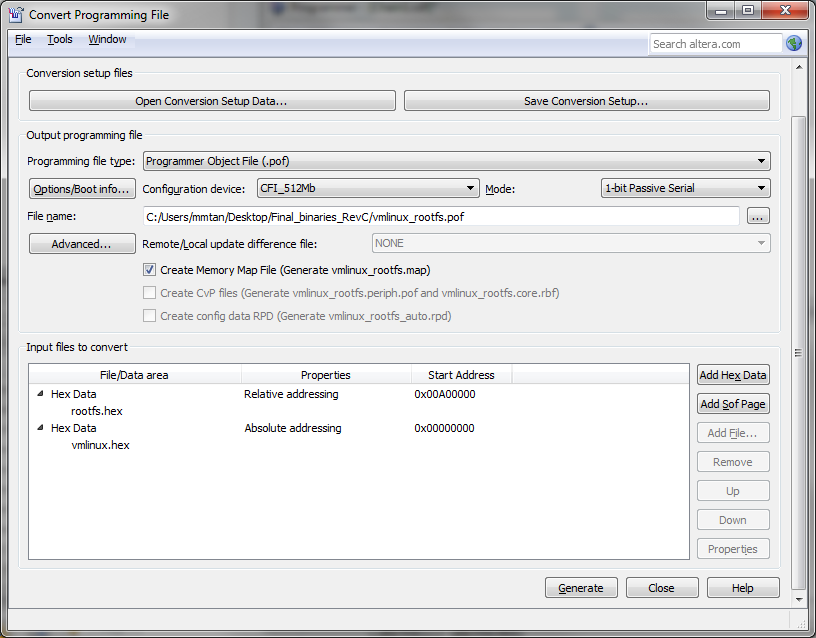

# Create a Downloadable Image

This procedure will guide the reader through the process of creating a
downloadable image file from a Linux kernel and root file system
image.  It is assumed that the user has built the requisite files
using buildroot, as described in [previous
instructions](buildroot-submodule.md).

## Install quartus 2 application

http://dl.altera.com/17.0/?edition=lite

Unzip the files and follow the installation instructions.  I installed
it in my home directory as a regular user, not as root.

## Convert kernel, file system to S-Records

Set up your environment variables:

```bash
$ export QUARTUS_ROOTDIR=${HOME}/intelFPGA_lite/17.0/quartus
$ export SOPC_KIT_NIOS2=${HOME}/intelFPGA_lite/17.0/nios2eds
$ export PATH=${PATH}:${HOME}/intelFPGA_lite/17.0/nios2eds/bin
```
### Kernel

Convert the kernel to a Motorola S-Record:

```bash
$ pushd output/images
$ elf2flash --base=0x0 --input=vmlinux --end=0xfffffff --reset=0x0 --boot=$SOPC_KIT_NIOS2/components/altera_nios2/boot_loader_cfi.srec
```

The procedure above produces the file: vmlinux.flash.

Convert the kernel & file system to hex records:

```bash
$ ../../output/host/usr/bin/nios2-linux-objcopy -O ihex vmlinux.flash vmlinux.hex
$ ../../output/host/usr/bin/nios2-linux-objcopy -O ihex -I binary rootfs.jffs2 rootfs.hex
$ popd
```

# Convert hex files to POF using Quartus

Navigate to the top directory of this project.

## Start Quartus:

```bash
$ ${QUARTUS_ROOTDIR}/quartus
```

Select menu option **File** -> **Convert Programming File**

The convert programming file popup will appear.



In the **Programming file type**, select **Programmer Object File
(.pof)**.

In the **Configuration device**, select **CFI_512 Mb**.

In the **File name:** field, select the output path for the POF file
to be generated ("output/images/vmlinux_rootfs.pof").

Remove the **SOF Page_0** in the **Input files to convert** section.

## Add the filesystem

Select **Add Hex Data**, then select **relative addressing** and
set **starting address** at 0x00A00000, choose "rootfs.hex" in the
file selection dialog.

**Note:** Setting the starting address at 0x00A00000 will allocate 54Mb of
the flash size for the root filesystem.

## Add the kernel

Select **Add Hex Data**, then select absolute addressing and choose
"vmlinux.hex".

**Note:** The kernel is at top half of the flash device with 10Mb of
flash size.

Click the **Generate** button to generate the POF file.

